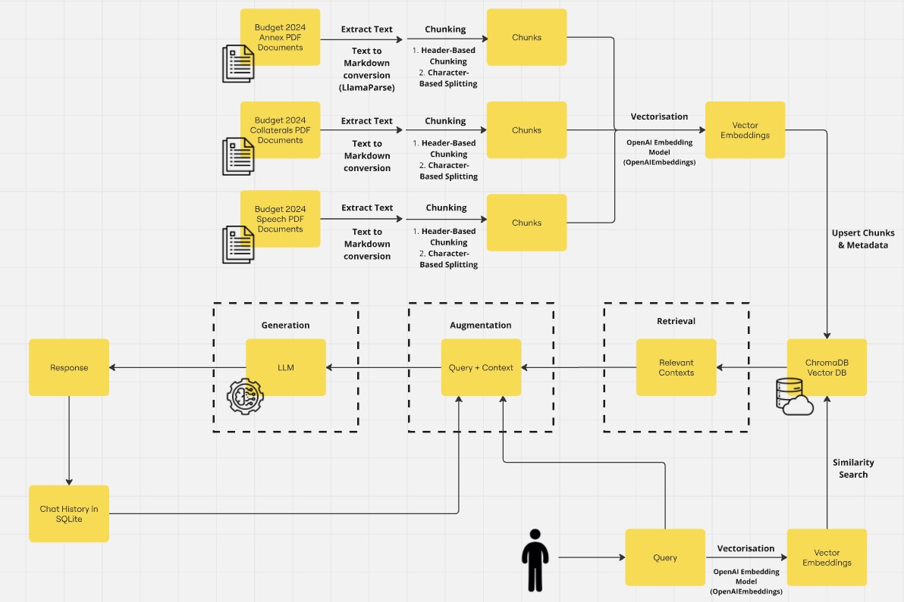
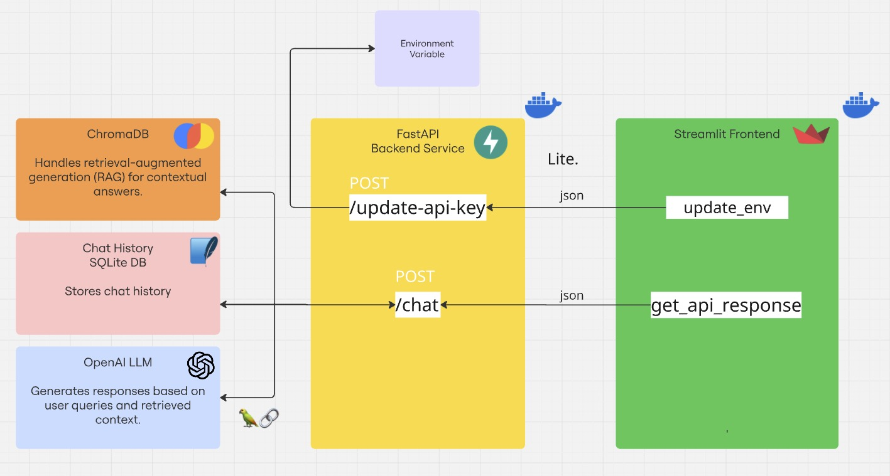

# 🚀 Developing a LLM Chatbot for Singapore's Budget 2024

### <u> Architecture Diagrams that highlight key components and the flow of information in the system </u>

Figure 1: Flow of information in the RAG model

Figure 2: Architecture Diagram

### <u> A brief explanation of the RAG implementation and its rationale </u>
1) Vector Store & Embeddings
- The system uses OpenAIEmbeddings to convert the extracted text documents (about Singapore’s Budget 2024) into vector embeddings. These embeddings are stored in a Chroma vector database 
2) Retriever
- A retriever fetches the most relevant document chunks based on the user’s query. It uses a similarity score threshold of 0.5 to filter out low-relevance documents.
3) History-Aware Question Rewriting
- The chain first uses a “contextualize” step (create_history_aware_retriever) to rewrite or clarify the user’s query in context. This ensures the query is self-contained, especially when a conversation has multiple turns referencing previous messages.
4) Question-Answering Chain
- After retrieving relevant document chunks, the retrieved context are combined with the user’s query before calling the LLM.
- The final chain returns an answer along with the context used.
6) Guardrails & Validation
- Before retrieving and generating an answer, the system checks the user query’s validity 
- If the query is deemed unrelated or invalid, the system returns a refusal message instead of proceeding with retrieval.

### <u> List of prompts designed for the LLM </u>
- Validation Prompt: 
    - User's query is fed into an LLM whose task is just to classify if a users query is valid and appropriate
    - Instructs the LLM to repsond with only Valid (if question is acceptable) or Invalid (if the question fails any of the listed criteria)
    - Acts as a safeguard prompt 
- Contextualise Question Prompt: 
    - To convert the user's question into a standalone query for the retrieval to reduce confusion
- System Prompt: 
    - Instructs the model to act as a Singapore MoF Assistant
    - Instructs the LLM to provide an answer if the question is about Singapores Budget 2024, using the retrieved context. Refuse to answer if it's not related to the Singapore Budget 2024

### <u> A list of prompts used to interact with the LLM, demonstrating the different scenarios the chatbot is expected to handle </u>
- Am I eligible for the Majulah Package?
- What are the payouts I can expect to receive in December 2024?
- What are the payouts that I can expect to receive in December 2024 as a 25 years old?
- What are the Key reasons for high inflation over the last two years?

### <u> How to set up and run the Chatbot application through Docker </u>
- Clone the repo to your local directory 
- Ensure that you have Docker installed, you can check by running `docker --version` in your terminal
- At the directory containing the `docker-compose.yaml`, run `docker-compose up --build`in your terminal
- Open the URL provided in the terminal, it should be `http://0.0.0.0:8501`

### <u> Environment variable to update the ChatGPT API Key </u>
- Input your ChatGPT API Key in the sidebar of the Streamlit App

